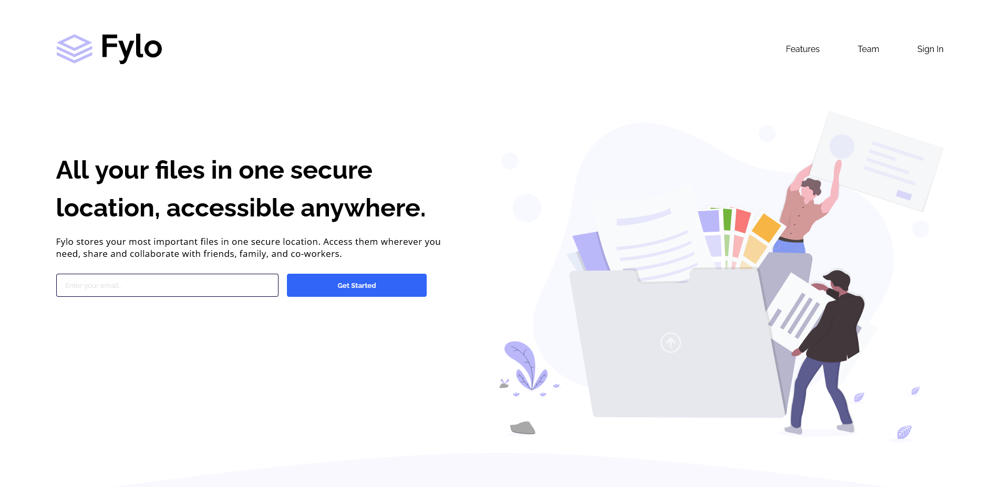

## Welcome! 👋

### Here's a quick look at my solution for the [Frontend Mentor](https://www.frontendmentor.io/home) challenge:

Fylo landing page with two column layout

[Live Link](https://neenreva.github.io/fylo-landing-page-with-two-column-layout-master/) [Solution Home](https://www.frontendmentor.io/challenges/fylo-landing-page-with-two-column-layout-5ca5ef041e82137ec91a50f5/hub/fylo-landing-page-with-two-column-layout-Irg58dAy31)

## The challenge 

Your challenge is to build out this landing page and get it looking as close to the design as possible.

You can use any tools you like to help you complete the challenge. So if you've got something you'd like to practice, feel free to give it a go.

Your users should be able to: 

- View the optimal layout for the site depending on their device's screen size
- See hover states for all interactive elements on the page

Want some support on the challenge? [Join our Slack community](https://www.frontendmentor.io/slack) and ask questions in the **#help** channel.

### Built with

- Semantic HTML5 markup
- CSS custom properties
- Flexbox
- Mobile-first workflow

### What I learned

This is a good junior level challenge to practice on. I challenged myself to knock this out in a day(8hrs). That didn't happen! I noticed that I end up having to go back to the markup to add complexity due to needs. My challenges start with me jumping straight into the IDE and that leads me to too many revisions. On the scale of complexity I feel pretty close to the bottom here and I can imagine the time saved will add up.

### Continued development

I want to work toward being able to develop something like this within a day.  Going forward I'm going to practice pseudo coding to develop better structure from the beginning. I hope to better identify issues like, needing a container or best properties for the use case.

### Useful resources

- [Pixel Perfect](https://chrome.google.com/webstore/detail/perfectpixel-by-welldonec/dkaagdgjmgdmbnecmcefdhjekcoceebi?hl=en) - Chrome extension - Great for getting precise wihtout having diamention information.

### As always feedback is welcome! Thanks for checking this out.
